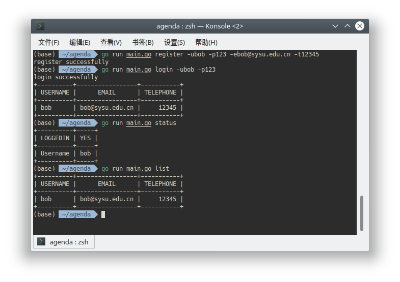
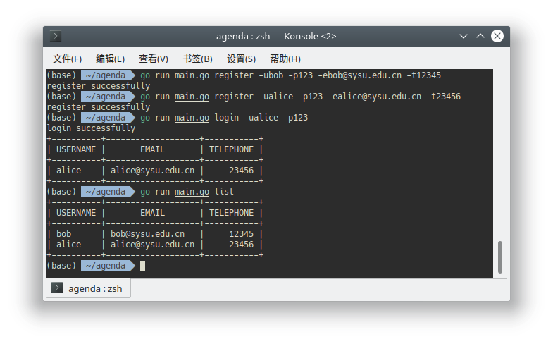
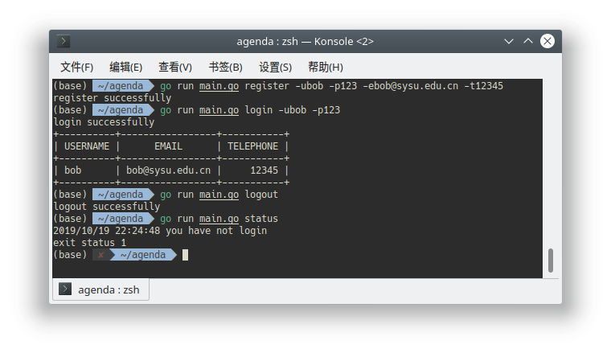
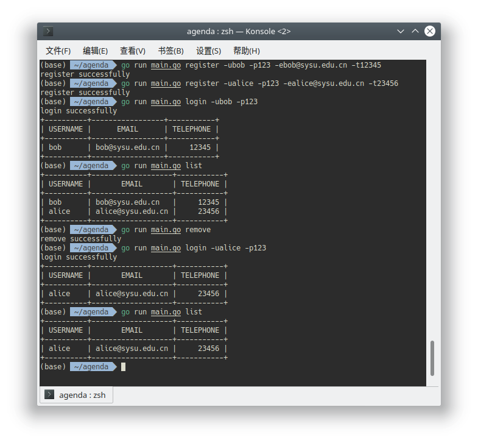

# Agenda(simplified)

支持用户的注册,登录,登出,删除,查看功能的命令行工具

### 代码目录

```bash
.
├── cmd
│   ├── list.go
│   ├── login.go
│   ├── logout.go
│   ├── register.go
│   ├── remove.go
│   ├── root.go
│   └── status.go
├── entity
│   └── user.go
├── go.mod
├── go.sum
├── LICENSE
├── main.go
├── model
│   ├── store.go
│   └── user
│       └── user.go
├── README.md
└── view
    └── prettyprinter.go

```

+ `cmd`目录下是`cobra`创建的子命令入口，除`root.go`以外的每个文件对应一个子命令
+ `entity`目录下是用户相关功能的处理逻辑
+ `model`目录下的`store.go`负责json数据的序列化存储到本地文件以及对应读取，`user/user.go`负责规定用户信息在内存中的存储形态及其持久化操作

### 功能测试

+ 单用户注册,登录,查看

  

+ 多用户注册,登录,查看

  

+ 登出功能

  

+ 删除功能

  