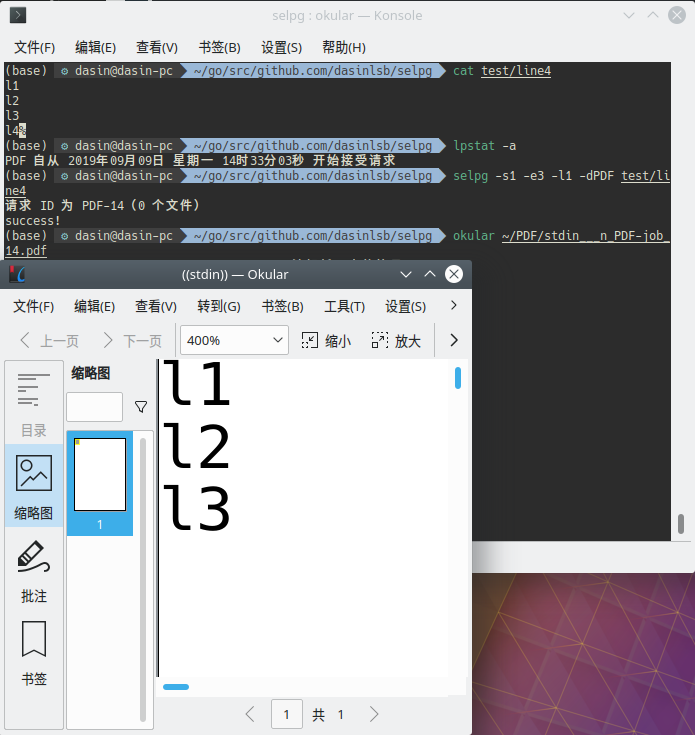

> 
>
> 中山大学 软件工程 服务计算课程作业 17343069
>
> repo: https://github.com/dasinlsb/service-computing/cli-selpg

# 开发简单CLI程序

## 解析参数

阅读 [开发 Linux 命令行实用程序](https://www.ibm.com/developerworks/cn/linux/shell/clutil/index.html)之后先对`selpg`的功能需求和对应参数做一下整理。

| 参数前缀 | 参数类型 | 缺省值 | 是否必须 | 功能                           |
| -------- | -------- | ------ | -------- | ------------------------------ |
| -s       | Int      | /      | 是       | 打印起始页                     |
| -e       | Int      | /      | 是       | 打印结束页                     |
| -l       | Int      | 72     | 否       | 制定每页行数                   |
| -f       | Bool     | false  | 否       | 是否以换页符'\f'为唯一换页标准 |
| -d       | StringP  | /      | 否       | 是否运行`lp`命令指定目标打印机 |

通过查阅`pflag`库的文档https://godoc.org/github.com/spf13/pflag完成解析相关参数的代码。

```go
	s_num := flag.IntP("start-tpage", "s", 0, "the start page to print [Required]")
	e_num := flag.IntP("end-page", "e", 0, "the end page to print [Required]")
	l_num := flag.IntP("line-number", "l", 72, "specify the number of lines in each page")
	f_sep := flag.BoolP("force-page-break", "f", false, "specify if pages will be forcely seperated by '\\f'")
	d_dest := flag.StringP("destination", "d", "", "specify if the output will be sent to printer")
```

## 参数合法性判断

初步对参数做合法性检验，比如页码必须是正整数，起始页码不能超过结束页码，-d和-f选项不能同时设置等。

```go
if *s_num <= 0 || *e_num <= 0 {
		elog.Println("positive start and end page required!")
		flag.Usage()
		os.Exit(1)
	}

	if *s_num > *e_num {
		elog.Println("start page cannot be larger than end page!")
		flag.Usage()
		os.Exit(1)
	}

	if *l_num != 72 && *f_sep {
		elog.Println("-d and -l cannot be set at the same time!")
		flag.Usage()
		os.Exit(1)
	}

	if *l_num <= 0 {
		elog.Println("line number should be positive!")
		flag.Usage()
		os.Exit(1)
	}

	if flag.NArg() > 1 {
		elog.Println("too many targets!")
		flag.Usage()
		os.Exit(1)
	}
```

## 输入

可以通过运行参数中是否有制定输入文件来判断是否要从IO管道中读取数据。

```go
	var reader io.Reader
	if flag.NArg() == 0 {
		reader = os.Stdin
	} else {
		file, err := os.Open(flag.Args()[0])
		if err != nil {
			elog.Println("error when read file!")
			os.Exit(1)
		}
		reader = file
	}
	buf_reader := bufio.NewReader(reader)
```

不管是从标准输入读入还是从文件读入都可以用`bufio`库中的`Reader`类作为容器。


## 数据处理

根据`-l`或`-f`参数的解析结果返回对应页码范围的内容。

```go
	if *f_sep {
		page_data := strings.Split(data, "\f")

		if len(page_data) < *e_num {
			elog.Printf("page number too large, only %d pages available!\n", len(page_data))
			flag.Usage()
			os.Exit(1)
		}

		result = strings.Join(page_data[*s_num - 1: *e_num], "\n")
	} else {
		lines := strings.Split(data, "\n")
		n_pages := (len(lines) + *l_num - 1) / *l_num

		if *e_num > n_pages {
			elog.Printf("page number too large, only %d pages available!\n", n_pages)
			flag.Usage()
			os.Exit(1)
		}

		if *e_num * *l_num <= len(lines) {
			result = strings.Join(lines[(*s_num-1)*(*l_num):(*e_num)*(*l_num)], "\n")
		} else {
			result = strings.Join(lines[(*s_num-1)*(*l_num):], "\n")
		}
	}

```

## 输出

若未制定`-d`参数的值则直接通过标准输出通道输出。

否则通过`exec`库中的`Command`类新建命令，并将上一步数据处理的结果作为该子命令的输入。

通过查阅官方文档发现官方处理子程序IO的方法是创建goroutine，在其中完成并关闭子程序的输入通道。

最后通过`CombinedOutput()`将子程序的stdout和stderr组合起来返回即可。

```go
	if *d_dest == "" {
		fmt.Print(result)
	} else {
		cmd := exec.Command("lp", "-d" + *d_dest)
		cmd_in, _ := cmd.StdinPipe()
		go func() {
			defer cmd_in.Close()
			io.WriteString(cmd_in, result)
		}()

		out, err := cmd.CombinedOutput()
		fmt.Print(string(out))
		if err != nil {
			elog.Println("error when execute command lp!")
			os.Exit(1)
		}
		fmt.Println("success!")
	}

```

## 测试

+ 测试`-f`参数


+ 测试管道输入及`-l`参数


+ 测试`-d`参数

