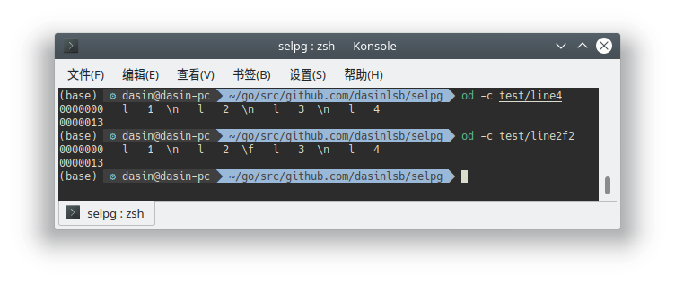

# selpg

selpg in golang

## Build

执行`go get && go install` 会安装依赖并将可执行文件 `selpg` 复制到 `$GOPATH/bin` 目录下。

## Run

直接运行`selpg`可以看到帮助信息。

## Test

`test`目录下有两个简单的测试输入文件: `line4`, `line2f2`。



`line4`的组成是

```text
l1\nl2\nl3\nl4
```

`line2f2`的组成是

```text
l1\nl2\fl3\nl4
```
