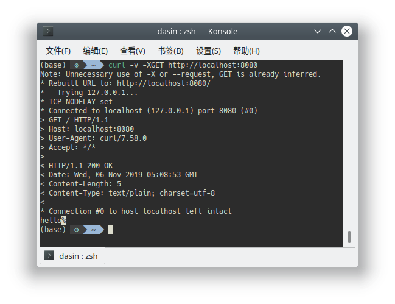
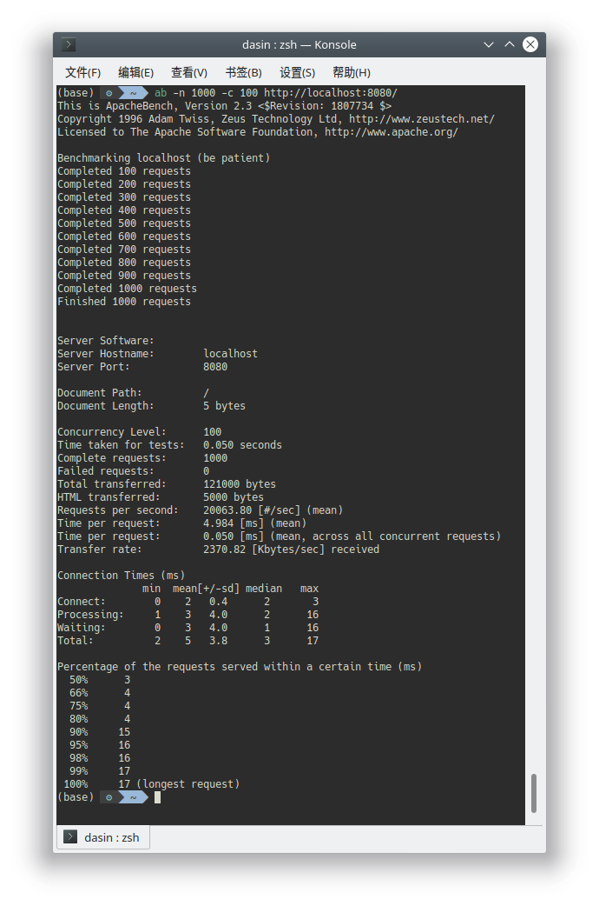
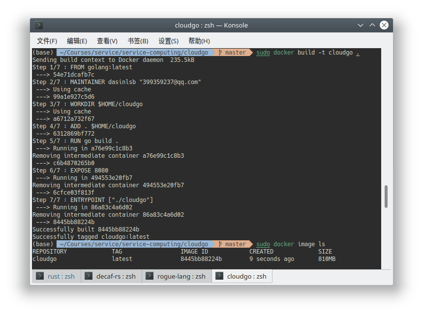
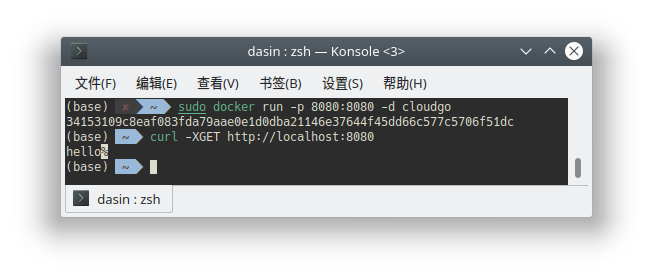

# 开发Web服务程序

开发简单web服务程序 cloudgo, 了解web服务器工作原理

```go
package  main

import (
	"fmt"
	"net/http"
)

func SayHello(w http.ResponseWriter, req *http.Request) {
	_, _ = w.Write([]byte("hello"))
}

func main() {
	http.HandleFunc("/", SayHello)
	fmt.Printf("Listening on port %v...\n", 8080)
	_ = http.ListenAndServe(":8080", nil)
}
```

+ 使用curl测试

  

+ 使用ab 测试

  

+ 构建docker镜像

  由于项目由`go mod `命令初始化, 所以直接放在任意目录

  ```dockerfile
  FROM golang:latest
  
  MAINTAINER dasinlsb "399359237@qq.com"
  
  WORKDIR $HOME/cloudgo
  
  ADD . $HOME/cloudgo
  
  RUN go build .
  
  EXPOSE 8080
  
  ENTRYPOINT ["./cloudgo"]
  ```

  制作镜像后将该镜像后台运行并映射出对应端口, 可以在主机网络中访问相应服务

  

  

