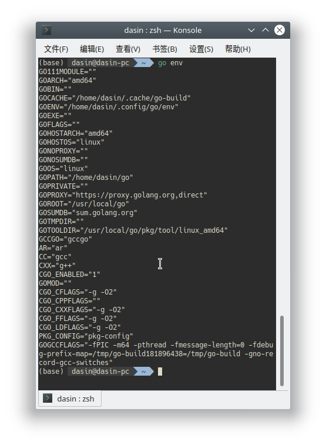
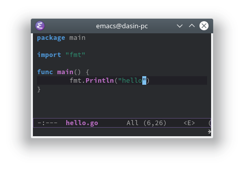
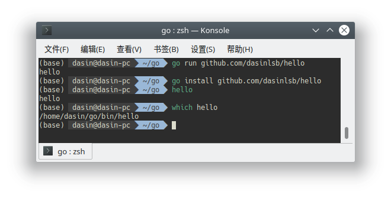
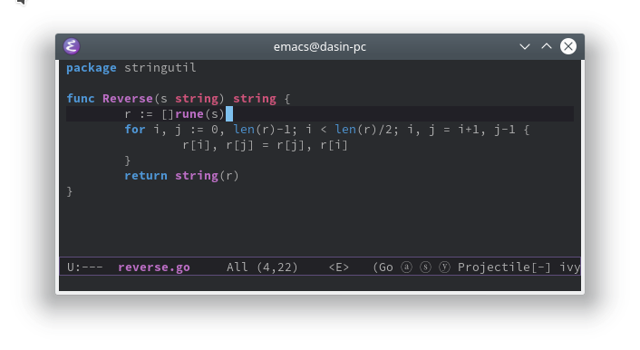
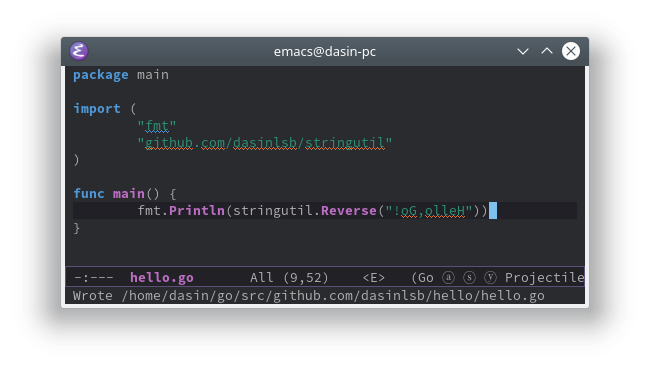
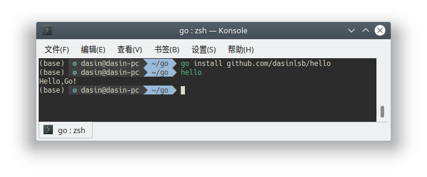
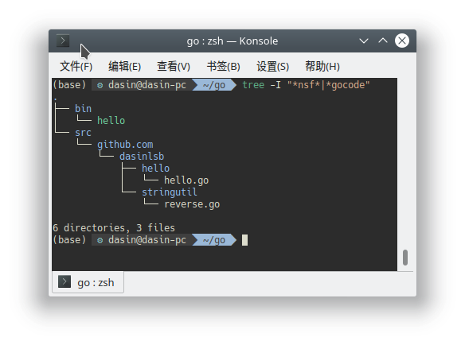
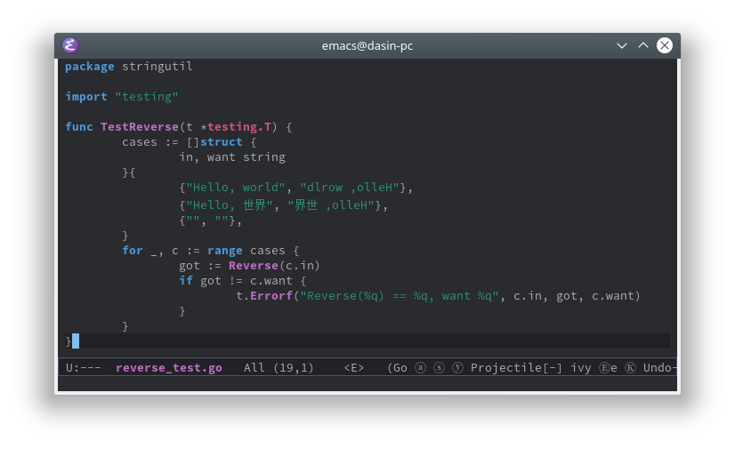
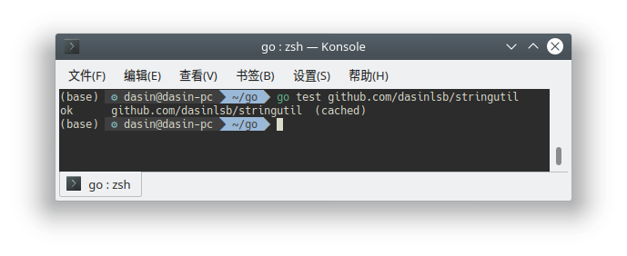
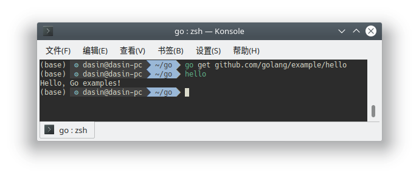

# 如何使用Go编程

> 软件工程 服务计算课程作业 17343069 
>
> repo：https://github.com/dasinlsb/service-computing/install-golang

参考学习官方文档 [如何使用Go编程](https://go-zh.org/doc/code.html)

## 安装Go

本地操作系统 Ubuntu18.04。

从官网 https://golang.org/dl 下载Linux下编译好的打包文件 [go1.13.linux-amd64.tar.gz](https://dl.google.com/go/go1.13.linux-amd64.tar.gz)。

运行

```bash
tar -C /usr/local -xzf go1.13.linux-amd64.tar.gz
```

之后将`/usr/local/go/bin` 添加到当前环境变量PATH即可。

## 编写第一个程序



运行`go env` 命令后看到默认`GOPATH=$HOME/go`，该工作空间还未创建，创建后在`$GOPATH/src/github.com/github-user`目录下新建第一个包目录`hello`，并在该目录下编写`hello.go`。



接下来运行`go run ..`会直接将包编译并临时可执行文件并运行，运行`go install ...` 会将相应的二进制程序放置到`$GOPATH/bin`目录下，将此路径添加到环境变量`PATH`之后也可以直接在终端运行。



## 编写第一个库

参照教程运行

```bash
mkdir $GOPATH/src/github.com/user/stringutil
```

并编写`stringuril.go`



修改之前编写的`hello.go`



运行`go install ..` 命令之后直接运行`hello`，可以看到符合预期的输出。 



可以看到当前目录的结构



## 测试

为stringutil编写测试用例。





## 远程包

运行`go get github.com/golang/example/hello` 拉取并安装官方实例仓库的hello包。

