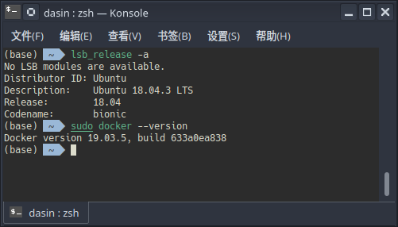
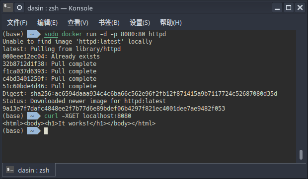
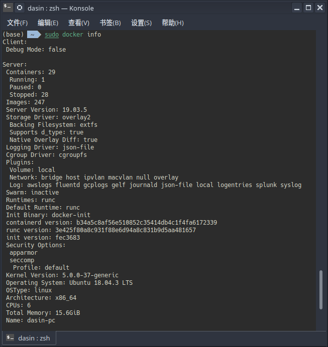
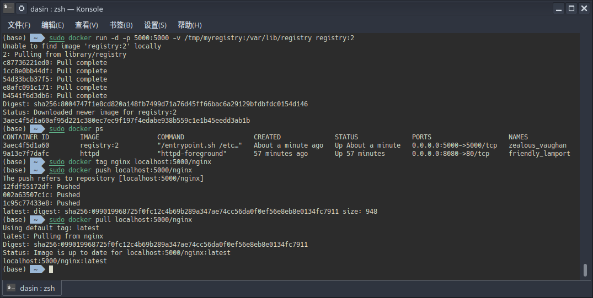

# 学习Docker容器技术 实验报告

| 学号     | 姓名   |
| -------- | ------ |
| 17343069 | 梁赛波 |

## 第一章

之前有一点Docker的使用经验，对它的印象就是一个快速方便干净地生成程序运行环境的工具，趁此机会深入理解一下

### 安装 Docker

本机系统就是Ubuntu，所以直接

### 运行httpd容器

因为本地80端口已经被占用了，所以映射到8080端口

后台运行容器之后`curl`可以成功获得数据

## 第二章

文章在介绍Docker的诞生背景时贴了下面一张图感觉十分形象

很多时候开发者难以<del>也懒的</del>用万全的方法应对各种环境问题，容器技术的出现可以极大地简化开发流水线的交付环节

Docker是经典的C/S架构，正常使用需要连接守护进程，不过使用包管理器安装直接把这个过程完成了，所以不必配置也能直接运行命令

`docker info`命令可以查看Docker daemon信息，这里由于直接跑在本机上，一些数据比如内核版本，CPU核心数等也是和本机匹配

## 第三章

看了这一章对Docker的运行机理理解加深了一些

+ 一般意义上的Docker应用需要建在各种Linux发行版的Docker镜像上

+ Linux操作系统由内核空间和用户空间组成，其中内核空间复用宿主机，而用户空间建立在根文件系统上，因发行版而不同

Ubuntu, CentOS等Linux操作系统镜像原来是把根文件系统rootfs解压到一个空的基础镜像scratch上

在新版本的Docker中采用了overlay技术可以将这个文件系统挂载过程再分解，感觉十分不可思议。

原来registry可以自己搭，在本地测了一下果然可以，发现新大陆

## 第四章

学习了一些新的姿势，比如`docker pause`以及限制容器获取宿主机资源的方法

> 第五章和第六章的内容比较熟悉，因为最近踩过坑，所以没有单独做记录

