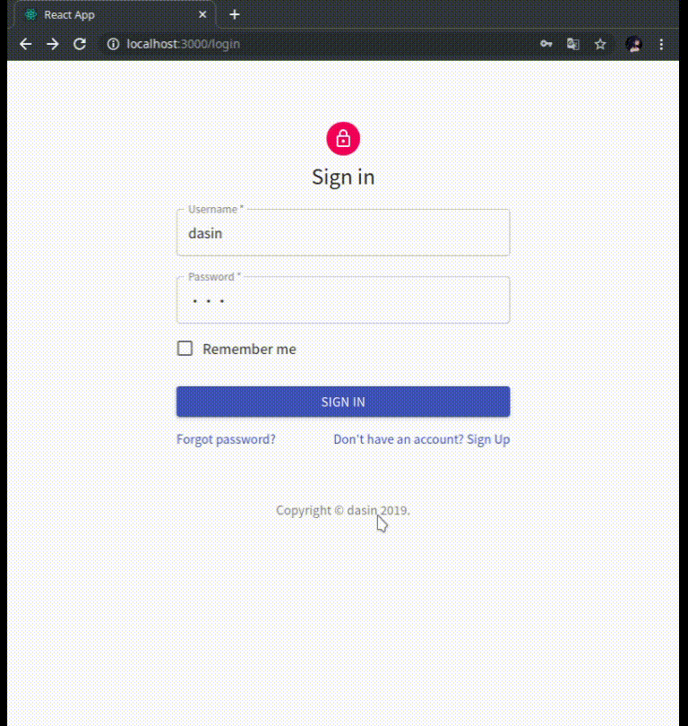

# Forum Mirror

[](https://travis-ci.com/dasinlsb/service-computing)

SYSU 2019 Service Computing [Homework](https://pmlpml.github.io/ServiceComputingOnCloud/ex-services)

A simple web application that craws and displays a part of [Emacs China](https://emacs-china.org)

## Preview



+ Please login with `username = dasin, password = 123`, because register part is not implemented yet >_<
+ Server will re-grab data every 30 minutes

## Build & Run

### Docker

#### Prerequisites

+ docker (19.03.4)
+ docker-compose (1.25.0)

Run the following command and visit `localhost:3000` on browser:

```bash
docker-compose up -d
```

You can modify exposed ports for web(3000) and for db(5432) in `./docker-compose.yml` if needed.

### Without Docker

#### Prerequisites

+ node (10.16.0)
+ yarn (1.19.1)
+ go (1.13)
+ postgres (10)

Backend's  configuration is `config/config.go`

Default connection from [gorm](https://github.com/jinzhu/gorm) to postgres will assume:

+ host: db:5432 
+ username: postgres
+ password: postgres

#### Run backend

Let server listen on `localhost:8080`

```bash
go run main.go [(none)|host:port|host port]
```

Pass 0, 1 or 2 arguments described above to configure the database connection if needed.

#### Run frontend

Launch React app on `localhost:3000` and visit it on browser

```bash
yarn
yarn start
```
